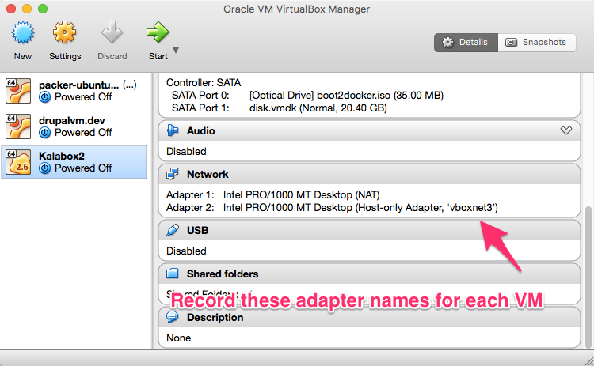
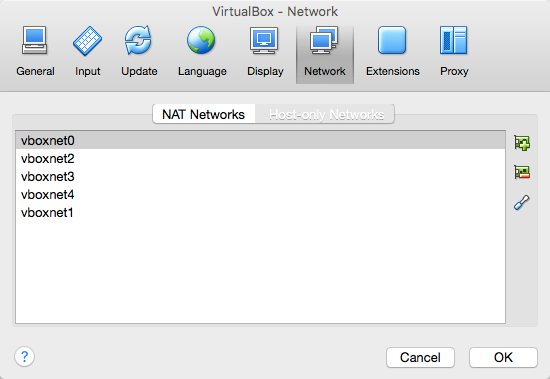

Logs
====

Kalabox has a few different log layers to help you diagnose any issues you might be having.

Install Logs
------------

If you have a failed installation, you should be able to find logs in the following locations...

* **Windows** - `%TEMP%\Setup Log**.txt`
* **MacOSX** - `/var/log/install.log`
* **Linux** - Differs per system but check common `apt` or `dnf/yum` logs

Runtime Logs
------------

If you encounter an error during runtime, check out the runtime log at...

  * **OSX/LINUX** - `~/.kalabox/logs/kalabox.log`
  * **Windows** - `C:\Users\{ME}\.kalabox\logs\kalabox.log`

!!! tip "Pro Tip: Use verbose or debug mode!""
    Run the failing command again with either the `-v` or `-d` option to get more useful debug output. But be careful because this output could contain sensitive information.

Docker Logs
-----------

One of the best ways to troubleshoot an issue is to get access to the Kalabox Engine and start hacking around.

!!! attention "Make sure you are ready to run Docker commands on the engine"
    Follow the instructions for [OSX/Windows](./general/engine/#engine-for-osxwin) or [Linux](./general/engine/#engine-for-linux)

**Some basic Docker commands**

Once you've completed the above you should be able to communicate with your containers. Here are a few helpful commands but please consult the official [Docker documentation](https://docs.docker.com/engine/) for a full spec of commands.

**List all my containers**
`docker ps --all`

**List all core kalabox containers**
`docker ps --all | grep kalabox_`

**List all containers for a particular app**
`docker ps --all | grep myappname`

**Inspect a container**
`docker inspect service_myappname_1`

**Check out the logs for a container**
`docker logs service_appname_1`

**Attach to a container (this is like SSHing)**
`docker exec -i -t service_appname_1 bash`

Container Logs
--------------

While you can get container logs by following some of the steps above you can also access specific container logs by mounting them back out onto your host machine. This is done by modifiying your `kalabox-compose.yml` file, which is a normal [Docker Compose](https://docs.docker.com/compose/compose-file/) with a bunch of extra [environmental variables](users/cli/#env) that Kalabox sets for you.

### Example: Sharing your entire logs directory

Here is a basic example of a `kalabox-compose.yml` `php` service that shares the entire `/var/log` directory of your container to `logs` inside of your app's root directory.

```yml
php:
  image: php-7.0
  hostname: $KALABOX_APP_HOSTNAME
  volumes:
    - $KALABOX_APP_ROOT_BIND/logs:/var/log
```

Resolving Duplicate Host Only Adapters
======================================

Any time you install a project that relies on VirtualBox (Docker Toolbox or a Vagrant-based project like Drupal VM are good examples), one of these host-only network adapters is created, and sometimes when you've frequently installed/uninstalled the same projects multiple times, these duplicates occur. Note that *ANY* duplicates (even if they aren't from Kalabox) can cause this issue.

Fortunately, removing these duplicates is fairly easy:

1. Open VirtualBox.

2. Look at each of your virtual machines and record the value for their "Host-only Adapter" under the "Network" section:

    
<br>
3. Now go to Preferences -> Network -> Host-only Network to see a list of all your adapters:

    
<br>
4. Delete any of the adapters that aren't being used by one of your virtual machines.
